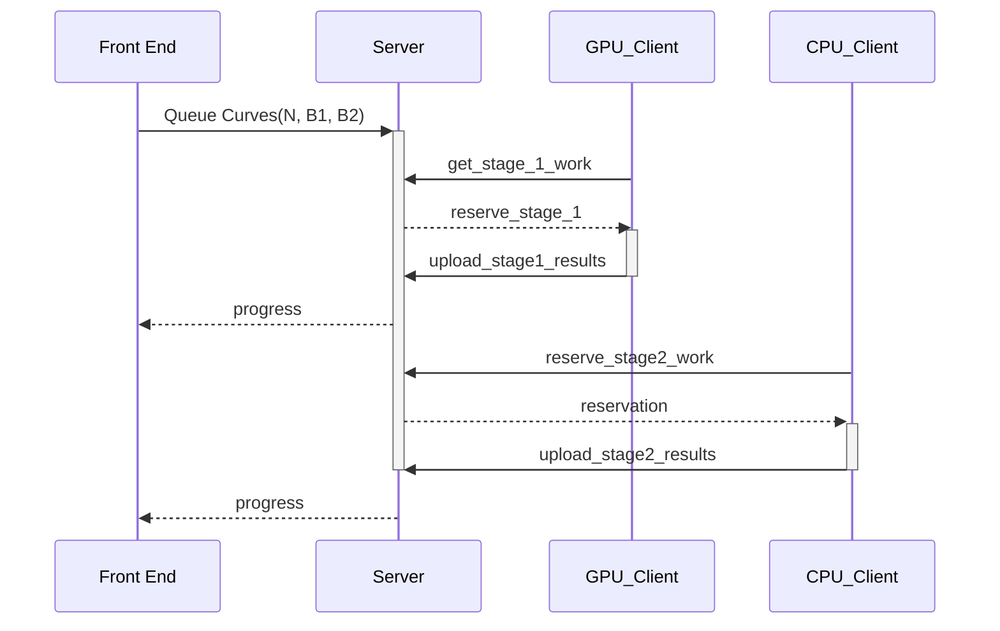

# Design

[2023/10/19] Writing down some thoughts about what my dream ECM setup would be.

## Goals

1. Record what work (e.g. curves/B1/B2) has been done
1. Estimate t-level completion
1. Keep queue of work

## Rough Design

Based on pull based client model from CADO-nfs, primenet, BOINC.

### Sequence Diagram

### Server

Python that tracks state

* Number
* Curves (B1, B2, count) complete
* Any factors that have been found.
* Stage 1 results and reservations
* For pratical purposes this probably needs to record finished curves (sigma) ranges

API:

* `queue_work(n, B1, B2, ...)`
* `get_stage1_work`
* `upload_stage1_results` (by client worker or manually from resume file)
* `reserve_stage2_work`
* `upload_stage2_results`
* `get_recent_factors`
* `get_status` / `get_progress`

### Client

Python wrapper around gmp-ecm ("ecm") that supports two modes (stage 1, stage2)

Runs "ecm" and tracking saving (and uploading) output

### Front-end

Some front-end to the server that lets you see factors found, query progress, queue numbers

## Complications

Trying to learn from [WraithX's ecm.py](https://www.mersenneforum.org/showthread.php?t=15508).

Features to name a few

* Canceling other stage2 curves when factor found
* Email reports, Progress Reports
* parselling out resume files
* Running multiple curves per innovation
  * Seems not to matter much for resuming stage 1, maybe more important if running stage 1 and 2 together.

Difficulties

* Lots of code to communicate with ecm
  * Lots of code related to arguments
    * maxmem: Learning from prime95 it's a hard problem to choose optimal memory split between workers.
* globals Ugh
*

## Open Questions

### 1 client for many ecm instances?

Pros:
  * Max mem is easier (split equally)
  * Easy to stop early
  * Can reserve all of a number's stage 1 curves without worrying about things to much
Cons:
  * Makes code uglier for multiple work units at the same time...

### Would this make more sense inside BOINC / PrimeNet?

Does BOINC support not verifying workunits?
Is there some way to verify ECM results?
  * Seems vaguely like VDF could be adopted
  * Any VDF papers covering elliptic curves?
